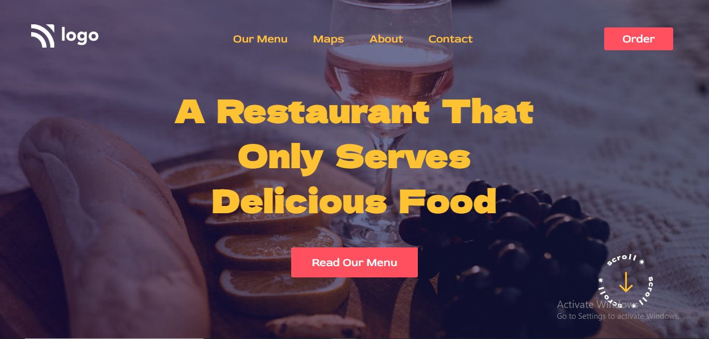

# Portfolio Project 2

## Description

This project is a restaurant home page created using `HTML` and `CSS`.

**Created By :** Shubham Purwar

**Time took to complete the project :** 2.5 hours

## What I learnt by creating this project :-

- How to create a navigation bar
- How to set a cover image using CSS properties `background-position` and `background-size`
- How to use `linear-gradient()` function over a cover image
- How to use CSS `transition` property on buttons

### Preview of the project :-

### [**Live link**](https://portfolio-project-2.vercel.app/) of the project.
